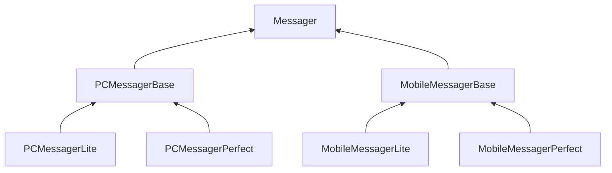
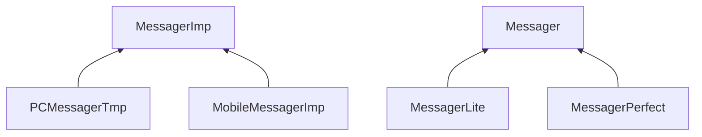

# Bridge

## Bridge1

类的总数是$1 + n + n*m$，其中`n`是平台实现部分的变化数目，`m`是业务抽象部分的变化数目

这里的业务抽象部分是不能进行组合的，细品与[Decorator](../decorator/)的区别

## Bridge2

`Messager`类成员中含有指向`MessagerImp`的指针

类的总数变为$1 + n + 1 + m$

