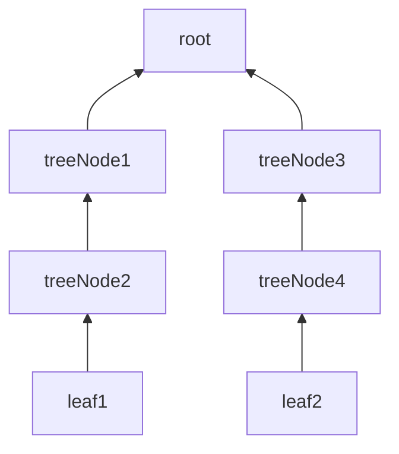

# Composite

示例中的树形结构：

```mermaid
graph BT
    treeNode1 --> root
    treeNode2 --> treeNode1
    leaf1 --> treeNode2

    treeNode3 --> root
    treeNode4 --> treeNode3
    leaf2 --> treeNode4
```
