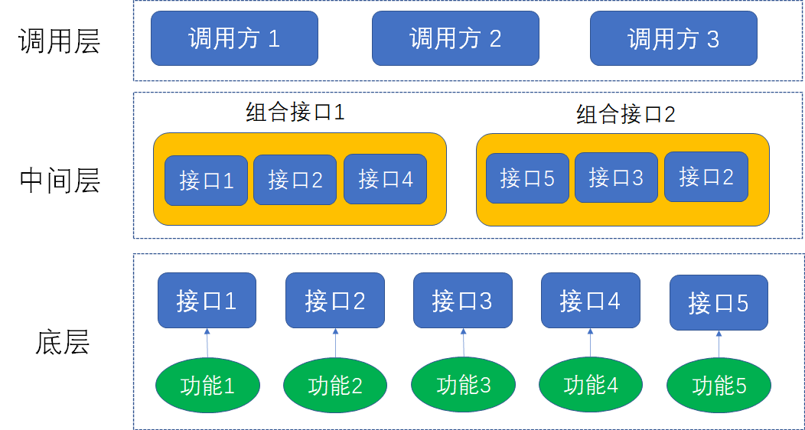

# Facade

Facade模式是一种结构性设计模式，它提供了一个简化接口来访问复杂系统中的一组接口。它隐藏了系统的复杂性，使得客户端可以更容易地使用系统，而无需了解其内部工作原理。

Facade模式由一个Facade类组成，该类提供了一个简单的接口，客户端可以通过这个接口来访问系统的所有功能。该类通常会将系统的内部工作委托给其他类来完成，从而实现了系统的封装。

> 图片来源：[漫画：设计模式之 “外观模式”](https://mp.weixin.qq.com/s/b2N4kkX4_KPffl7Kt5x4iA)

