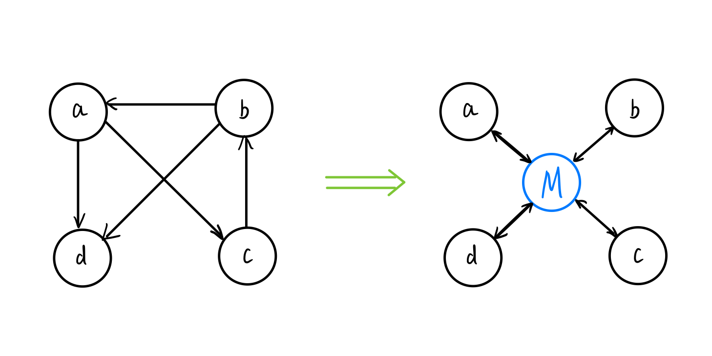

# Mediator

Mediator设计模式是一种行为型设计模式，它允许对象之间通过中介者对象进行交互，而不是直接相互通信。这种模式能够减少对象之间的耦合度，使得它们更加独立和可维护。

在Mediator设计模式中，中介者对象充当了所有对象之间的协调者。它负责接收来自不同对象的请求，并将这些请求转发给其他对象，以便它们可以相互协作完成任务。这种模式可以将复杂的系统分解成更小的部分，使得每个部分都可以独立地进行开发和维护。

Mediator设计模式的优点包括：

- 减少对象之间的耦合度，使得它们更加独立和可维护。
- 简化了对象之间的通信，使得系统更加清晰和易于理解。
- 提高了系统的灵活性和可扩展性，使得新的对象可以很容易地添加到系统中。

在实际应用中，Mediator设计模式通常用于复杂的系统中，例如GUI界面、网络应用程序等。它可以帮助开发人员更好地组织和管理各种对象之间的交互，从而提高系统的性能和可靠性。

